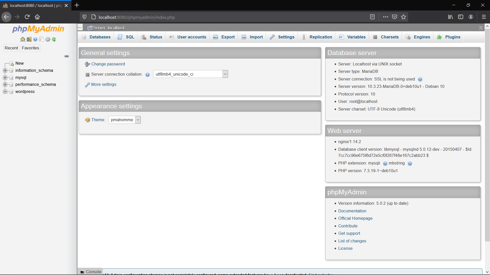
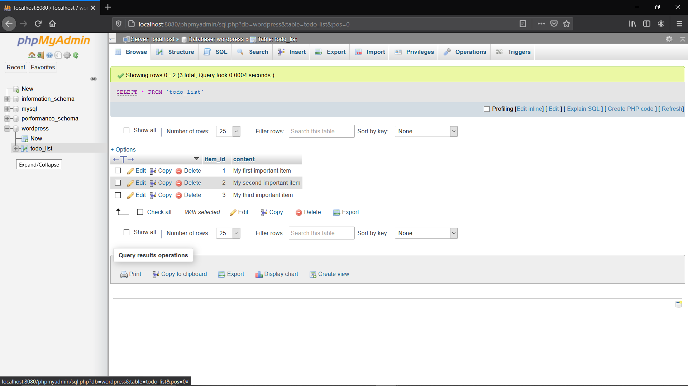
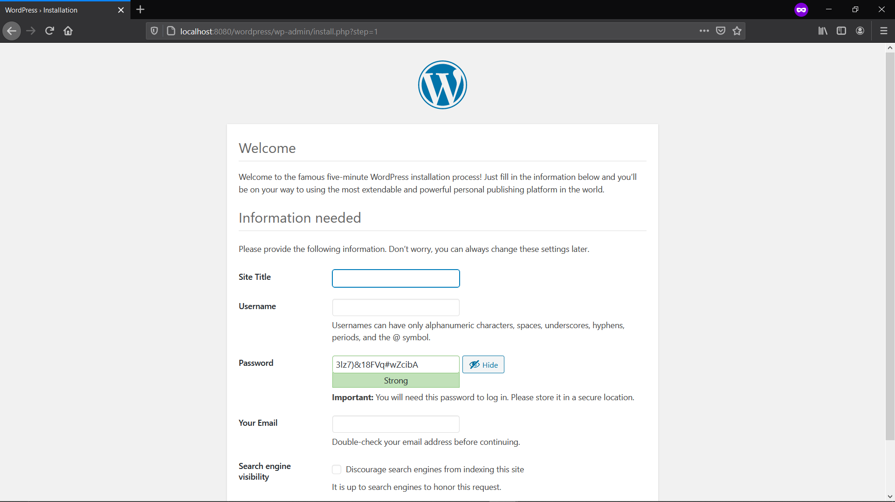
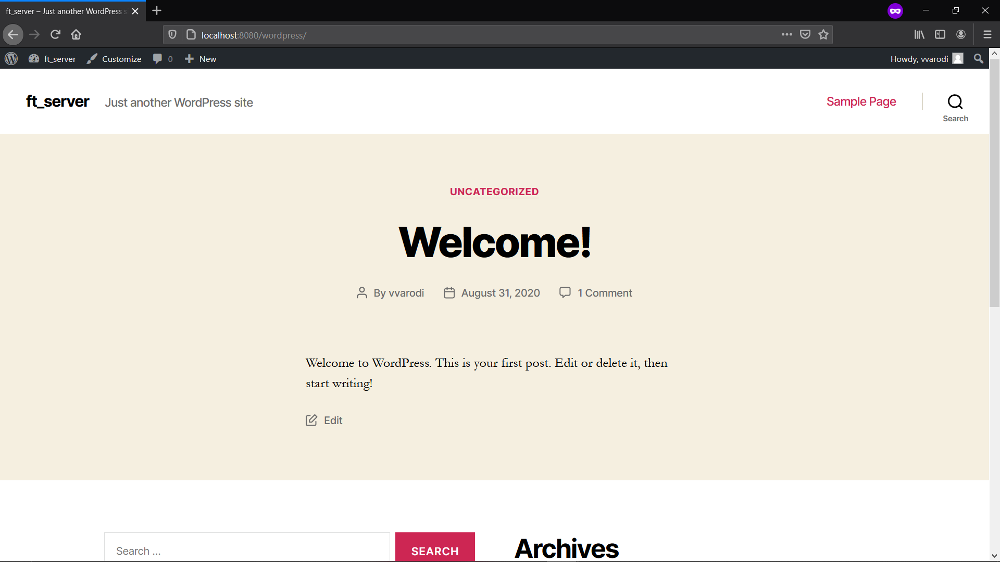
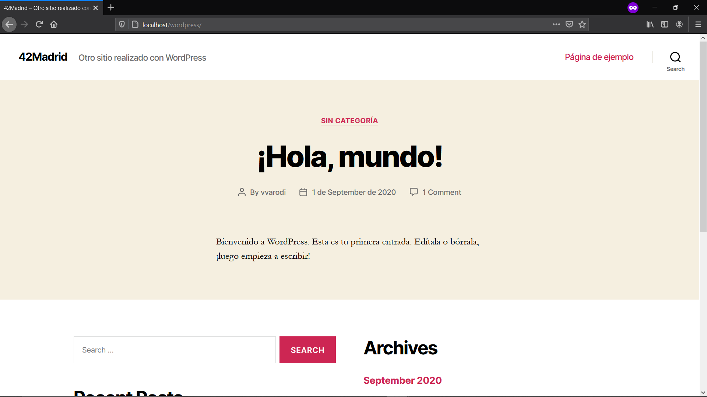
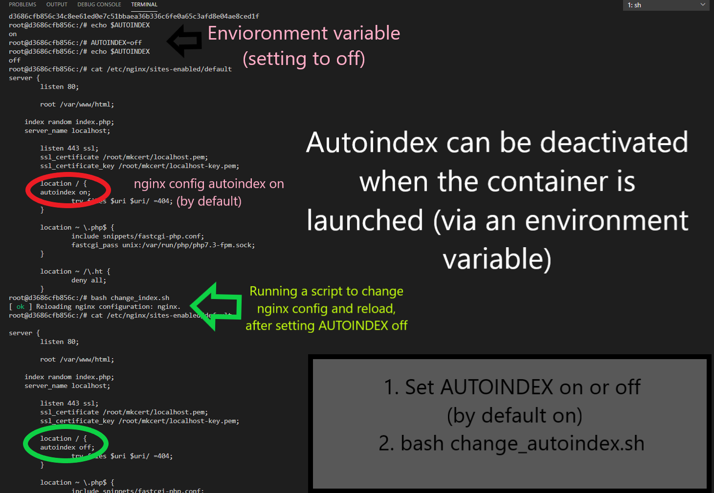
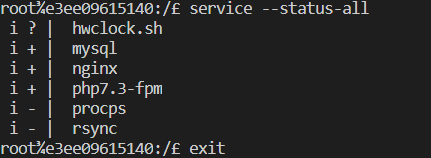

# ft_server

## Guide

### Step 1: Nginx installed to serve your content.

 ```
 /etc/nginx/sites-available/* Extra virtual host configuration files
 /etc/nginx/sites-enabled/* Symlink to sites-available/<file> to enable vhost
 ```


### Step 2: Installed PHP for Processing && Configuring Nginx to Use the PHP Processor


### Step 3: MySQL installed to store and manage your data. 
MariaDB (database system) installed to store and manage data for your site, some Linux distributions (including Debian) use MariaDB as a drop-in replacement for MySQL
[Installation](https://www.digitalocean.com/community/tutorials/how-to-install-linux-nginx-mariadb-php-lemp-stack-on-debian-10#step-2-%E2%80%94-installing-mariadb) --> [code](img/mariadb.png)
```
+--------------------+
f Database           f
+--------------------+
f information_schema f
f mysql              f
f example_database   f
f performance_schema f
+--------------------+
4 rows in set (0.000 sec)
```
### Step 4: phpMyAdmin installed to handle the administration of MySQL over the Web.


Checking connection between MySQL and phpMyAdmin: Testing Database Connection from PHP [code](img/display_db_table.php)




### Step 5: WordPress




Checking connection between MySQL/phpMyAdmin with WordPress: wordpress database


Exporting database and Connecting my database to wordpress. This way I see the page when going to http://localhost/wordpress and not wordpress config

http://localhost/wordpress/wp-admin to modify

(Not at final version) Commit -> [code](https://github.com/vvarodi/ft_server/tree/81676fb35a22d645eb20199602fa9ab329d86670)



## Autoindex
  * [Autoindex-error](https://serverfault.com/questions/940276/force-nginx-to-always-autoindex-and-ignore-index-html-files)
  * [autoindex off-error 403](https://stackoverflow.com/questions/10663248/how-to-configure-nginx-to-enable-kinda-file-browser-mode)
"Without autoindex option you should be getting Error 403 for requests that end with / on directories that do not have an index.html file. With autoindex on you should be getting a simple listing"

**Autoindex ON**

**Autoindex OFF**
``` 
docker build -t ft_server . --build-arg autoindex=off
```


Verifying if the server is running with an autoindex which can be desactivated when the container is launched (via an environment variable)


## Handle errors:

If your page is not loading or throwing an error. Inspect:
``` 
cat /var/log/nginx/access.log
cat /var/log/nginx/error.log
```
To see all running services:

```
service --status-all 
```



## Resources/Research:
* **Docker**
  * [Get started with Docker](https://docs.docker.com/get-started/)
  * [Docker curriculum](https://docker-curriculum.com/)
  * [The Docker Handbook](https://www.freecodecamp.org/news/the-docker-handbook/)

* **Dockerfile:** a text file that contains all commands, in order, needed to build a given image.
  * [Dockerfile-best-practice](https://docs.docker.com/develop/develop-images/dockerfile_best-practices/)
  * [Dockerfile-reference](https://docs.docker.com/engine/reference/builder/)
  * [ARG-ENV](https://vsupalov.com/docker-arg-env-variable-guide/) Build-time configuration with ARG && Run-time Environment Replacement using ENV 

* **Web Server:** a web server stores and delivers the content for a website – such as text, images, video, and application data – to clients that request it.
  * [What is a web server?](https://developer.mozilla.org/en-US/docs/Learn/Common_questions/What_is_a_web_server#:~:text=A%20static%20web%20server%2C%20or,application%20server%20and%20a%20database.)
  * [How To Install Linux, Nginx, MariaDB, PHP (LEMP stack) on Debian 10](https://www.digitalocean.com/community/tutorials/how-to-install-linux-nginx-mariadb-php-lemp-stack-on-debian-10)
   LEMP stack means: Linux, Nginx, MySQL, PHP.

* **Debian**
  * [About Debian](https://www.debian.org/intro/about)
  * [Debian Directory Structure](https://wiki.debian.org/Nginx/DirectoryStructure)
  * [wget](https://www.gnu.org/software/wget/) use it to retrieve content and files from various web servers
  * [How to Use sed to Find and Replace String in Files](https://linuxize.com/post/how-to-use-sed-to-find-and-replace-string-in-files/) (autoindex on/off)

* **Nginx**
  * [Default nginx configuration](img/default)
  * [Nginx 502 Bad Gateway Error](https://ibcomputing.com/nginx-502-bad-gateway-error/)

* **mariadb** (database system) installed to store and manage data for your site
  * [mysql_secure_installation](https://mariadb.com/kb/en/mysql_secure_installation/) a shell script available on Unix systems, and enables you to improve the security of your MariaDB installation

* **phpMyAdmin** phpMyAdmin is a free software tool written in PHP, intended to handle the administration of MySQL over the Web.
  * [phpMyAdmin Documentation](https://docs.phpmyadmin.net/en/latest/)
  * [phpMyAdmin Configuration](https://docs.phpmyadmin.net/en/latest/config.html#)

* **WordPress**  
  * [How to install](https://wordpress.org/support/article/how-to-install-wordpress/)
  * [wp-config.php](https://wordpress.org/support/article/editing-wp-config-php/)

* **SSL**
  * [Types of ssl certificates](https://phoenixnap.com/kb/types-of-ssl-certificates)
  * [mkcert](https://github.com/FiloSottile/mkcert/)
  * [Creating a Self-Signed SSL Certificate](https://linuxize.com/post/creating-a-self-signed-ssl-certificate/)
  * [openssl tutorial](https://phoenixnap.com/kb/openssl-tutorial-ssl-certificates-private-keys-csrs)
  * [HTTPS for localhost](https://www.freecodecamp.org/news/how-to-get-https-working-on-your-local-development-environment-in-5-minutes-7af615770eec/)
